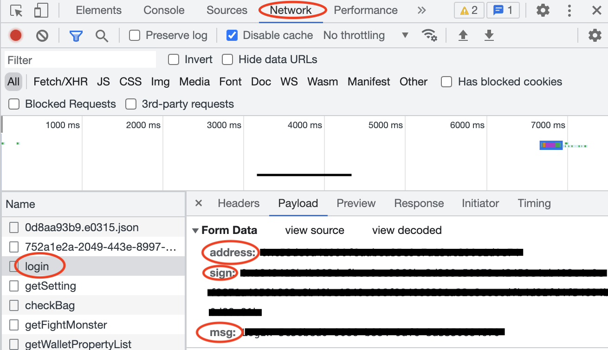

# P2EHub Community - Radiocaca Metamon Game

### Install Nodejs

Please head to https://nodejs.org/en/download/ to download and install latest nodejs(LTS version).

### Update settings

1. Go to [metamon game](https://metamon.radiocaca.com/) 

2. Open chrome developer tools

3. Login your account with Metamask

4. Look for "login" under Network tab, you will find three fields in the playload tab: address, sign and msg.

   

5. Copy the 3 fields and paste in radiocaca/settings.js file correspondingly.

### Run

Open your terminal(Mac) or CMD(win), and change directory to p2ehub-community/radiocaca.

Run below commands to install dependencies.

```shell
npm install
```

And fianally, you can start the script using

```shell
npm start
```